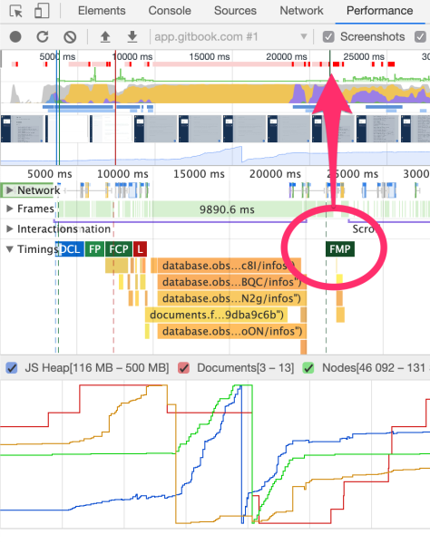
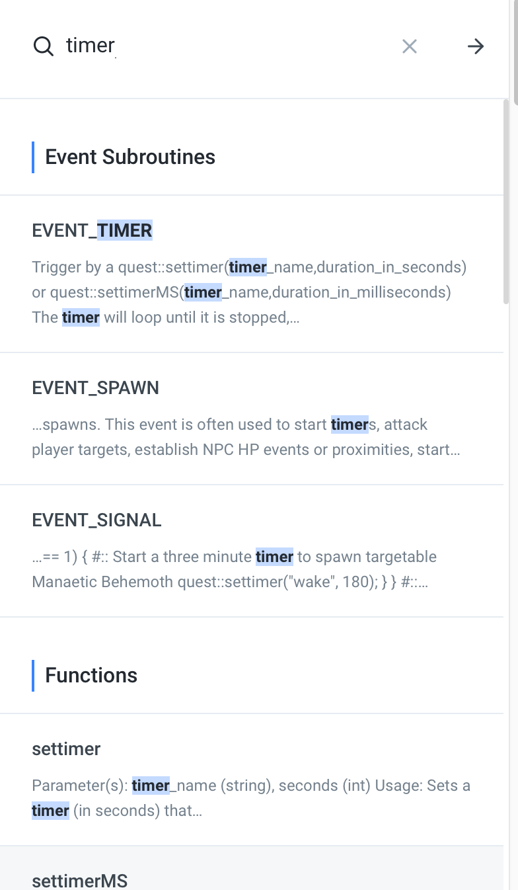

# Quest API

## EQEmu Wiki Assets

| Space | Description |
| :--- | :--- |
| [EQEmu Wiki](https://eqemu.gitbook.io/server/) | The main EQEmu Wiki space |
| [Changelog](https://eqemu.gitbook.io/changelog/years/latest-changes) | A listing of all of the changes made to the EQEmu Server code |
| [Database Schema](https://eqemu.gitbook.io/database-schema/) | The blueprint of how the EQEmu database is constructed |
| [GitHub](https://github.com/EQEmu/Server) | The EQEmu Server Repository |

## EQEmu Quest API


The programmer, like the poet, works only slightly removed from pure thought-stuff. He builds his castles in the air, from air, creating by exertion of the imagination.   
- Frederick P. Brooks, Jr.


## Getting Started

If you are new to the EQEmu Quest API, it can easily be daunting to try to digest the vast array of methods, functions, subroutines, plugins, and varying quest-scripting languages.  Quest scripts in EQEmu are written in [Lua](https://www.lua.org/) or [Perl](https://www.perl.org/), both of which are widely accepted throughout the EQEmu community.

**If you are new to both Lua and Perl**, a good place to get started is the [Beginner's Guide to Perl and Lua](methods/beginners-guide.md).

**If you are adept at either Lua or Perl**, it is best to familiarize yourself with how EQEmu [loads quests scripts](methods/quest-loading.md), followed by reviewing the various [Events](methods/events.md) that can be triggered in either Perl or Lua, along with  exports of those events \(as well as the [global exports](perl/exports.md)\), and then beginning to review the many methods and functions exposed in the API.

## I Can't Find \_\_\_\_\_\_\_\_

The Quest API for EQEmu Server is _massive_.  We have tried to put all of the information on a single page, but the loading times were awful, simply due to the vast amount of information and examples found on the pages in this space.  As a result, we have separated all of the documentation into separate pages for faster reference.

Please use the navigation bar along the left-hand side to locate the documentation that you are seeking.  If you are not sure where a method or function may reside, be sure to use the search function--it is amazing!

## To Perl, or to Lua?

The decision to utilize either Perl or Lua for your quest scripts is entirely up to you.  Both offer nearly all the same functions and methods--where discrepancies exist, they are noted \(for instance the [Spell Methods \(Lua\)](methods/spell-methods-lua.md) page describes methods only available in Lua.  Beginners often find Perl easier to understand. Adept Lua programmers might enjoy the ability to load encounters.  Advanced Perl programmers may find the ability to create or utilize [plugins](perl/plugins/) very desirable.

All attempts have been made to provide corresponding examples in both languages throughout this Wiki.  Many community members have a preference, and certainly there are many members of the community that can provide you guidance for either language--please look for us in the **\#Support-Quest-Scripts** channel on the [EQEmu Discord](https://discord.gg/QHsm7CD) server.

