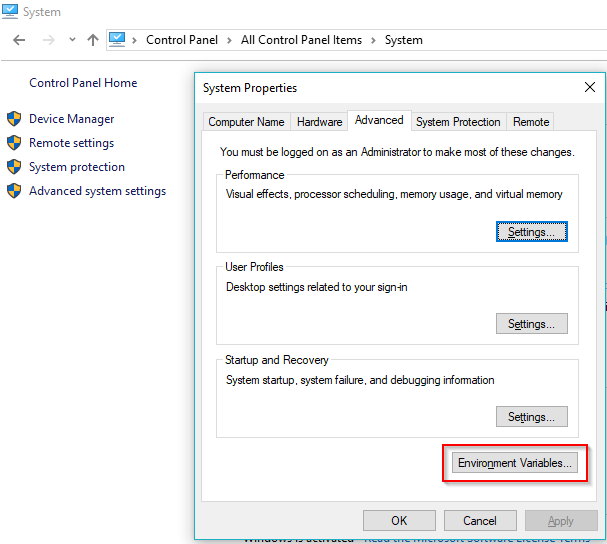

# Beginner's Guide to Perl and Lua

EQEmu makes use of both Perl and Lua for quest scripting.  Both Perl and Lua have many online resources to get you started.  

Learn Perl:  [https://hackr.io/tutorials/learn-perl](https://hackr.io/tutorials/learn-perl)

Learn Lua:  [https://hackr.io/tutorials/learn-lua](https://hackr.io/tutorials/learn-lua)

## Real Use Examples

### **Conditionals**

**Syntax**



```perl
if ($variable1 [operator] $variable2) {
    quest::commands;
}
```



```lua
if (variable1 [operator] variable2) then
    eq.commands;
end
```



**Example:**



```perl
if ($variable1 [operator] $variable2) {
    quest::commands;
} elsif ($variable1 [someotheroperator] $variable2) {
    quest::commands;
} else {
    quest::commands;
}
```



```lua
if (variable1 [operator] variable2) then
    eq.commands;
elseif (variable1 [someotheroperator] variable2) then
    eq.commands;
else
    eq.commands;
end
```



### Operators

Note, special operators apply to string comparisons in Perl!



```perl
$a == $b    #:: If variable $a is the same as variable $b, carry on.
$a != $b    #:: If variable $a is NOT the same as variable $b, carry on.
$a > $b    #:: If variable $a is greater than variable $b, carry on.
$a < $b    #:: If variable $a is less than variable $b, carry on.
$a >= $b    #:: If variable $a is greater than or equal to variable $b, carry on.
$a <= $b    #:: If variable $a is less than or equal to variable $b, carry on.
$a eq $b    #:: If string variable $a is the same as string variable $b, carry on.
$a ne $b    #:: If string variable $a is NOT the same as string variable $b, carry on.
$a =~ $b    #:: If string variable $a contains/matches the string variable $b, carry on.
```



```lua
a == b    #:: If variable a is the same as variable b, carry on.
a != b    #:: If variable a is NOT the same as variable b, carry on.
a > b    #:: If variable a is greater than variable b, carry on.
a < b    #:: If variable a is less than variable b, carry on.
a >= b    #:: If variable a is greater than or equal to variable b, carry on.
a <= b    #:: If variable a is less than or equal to variable b, carry on.
a:findi(b)    #:: If string variable a contains/matches the string variable b, carry on.
```



In this example, if the user is a smaller level than the mob the mob says "I'm a higher level than you!"



```perl
sub EVENT_SAY {
	if ($ulevel < $mlevel) {
		quest::say("I'm a higher level than you!");
	}
	
	if ($text =~ /Hail/i) {
		quest::say("Bye!");
	}
}
```



```lua
function event_say(e)
	if (e.other:GetLevel() < e.self:GetLevel()) then
		e.self:Say("I'm a higher level than you!");
	end 

	if (e.message:findi("Hail")) then
		e.self:Say("Bye!");
	end
end
```



### Perl Regular Expressions



All speaking responses are included in the **$text** variable.

Perl [REGEX](https://perldoc.perl.org/perlre.html) allows you to use more specific string comparisons.

```perl
if ($text=~/hail/i)    #:: Note the /i. This means it is case-insensitive. It is always better to include this.
if ($text=~/Hello/)    #:: Would match "Hello", but not "hello".
if ($text=~/hello/)    #:: Would match "hello", but not "Hello".
if ($text=~/hello/i)    #:: Would match "Hello" and "hello".
if ($text=~/me/)    #:: Would match the "me" in "name", but not the "me" in "NAME".
if ($text=~/\bme\b/)    #:: Would not match the "me" in "name" or the "me" in "NAME". The "\b" means there must not be text next to the match so "me" must be by itself.
if ($text=~/^me$/i)    #:: Would only match if "me" is the only text said. The "^" tells what must be the first thing said and the "$" tells what must be the last thing.
```





Indicated by the "\|" symbol you can check against multiple different strings at the same time.

```perl
if ($text=~/Hail|Hi|Hello/i)    #:: Will check if the text contains "Hail", "Hi", or "Hello".
if ($text!~/Hail|Hi|Hello/i)    #:: Will check if the text does not contain "Hail", "Hi", or "Hello".
```



These responses allow you to check for multiple strings within your text variable.

## Debugging



If you have Perl installed you may need to add the path to your Perl folder to your "Path" environment variable.



After you open the window you will see multiple different variables, choose "Path".

If you find something similar to this you will be able to use the Perl compiler.


Once you have Perl installed and a Proper Path environment variable you will need to restart your computer.

Try adding this script in a zone with the name "test.pl".

```perl
# Something is broken here, can you find it?
sub A {
	my $time = 123d;
	print $time;
}
A();
```

If you open your command line and navigate to your directory you can compile the script and check for errors.

To navigate to your directory you can type something like this.

```text
cd D:/Server/quests/zone
```

To compile the script you can type something like this.

```text
perl -cw test.pl
```

You should receive a message in your window like this.

```text
D:\Server\plugins>perl -cw t.pl
Bareword found where operator expected at t.pl line 3, near "123d"
        (Missing operator before d?)
Unquoted string "d" may clash with future reserved word at t.pl line 3.
syntax error at t.pl line 3, near "123d"
t.pl had compilation errors.
```

This allows you to see which line, which is line 3, what it is near, "123d", and what the issue is "unquoted string d".

Due to this descriptiveness you should be able to diagnose and fix issues much more quickly.







